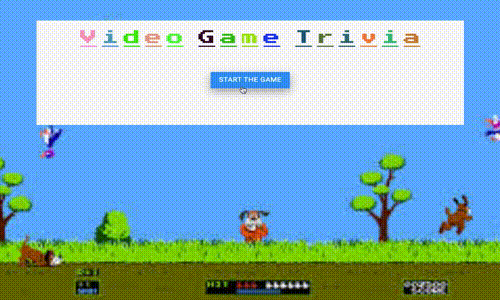

# 
Trivia-game

#### 
Game Play

## 
Overview

A web application that asks a series of questions. Each question uses a countdown timer to listen for a users guess. Jquery is used to update HTML document.

## 
How To Play

1. To start the game the user has to click the start button.
2. The user will then answer the question that is asked by clicking on the answer button.
   - If the question is correct an image based the answer along with "That is Correct" populates the screen and a variable with correct answers is stored.
   - If the question is inncorrect an image based the answer along with "That is Incorrect" with the correct answer is displayed and a variable with incorrect answers is stored.
   - If time exprires without the question being answered an image based the answer along with "Time expired" with an answer is displayed and a variable for both incorrect and unanswered is stored.
3. After all questions have been asked the displayed screen will show the total of correct, incorrect and unanswered. A display message of "Thanks for playing" will also populate the screen and after a set time the game will restart without user input.
